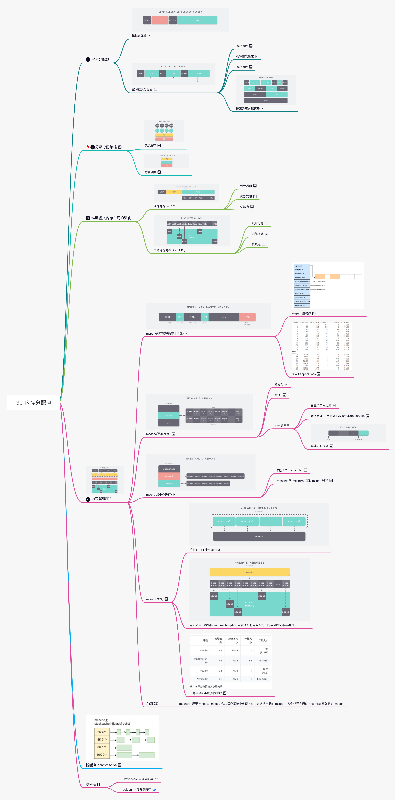

`特此声明：本仓库是基于https://github.com/NotInWine/xmind-to-md 基础上稍加改造而来。`

# Processon To Markdown
 [Processon](https://www.processon.com/u/5ab9cb2de4b018c271cab8d4/profile) 的.pos 格式思维导图转 Markdown 文本

## 效果
- 原始脑图1

- 效果图


## [Demo 示例](src/main/java/com/golden/demo/Main.java)
```java
package com.golden.demo;

public class Main {

    public static void main(String[] args) throws IOException {
        StringBuilder posBuilder = new StringBuilder();
        ToMdUtils.toMD("./demo/go_memory_allocator.pos", i -> {
            System.out.print(i.toString());
            posBuilder.append(i.toString());
        });
        Files.write(Paths.get("./demo/go_memory_allocator_pos.md"), posBuilder.toString().getBytes());
    }
}

```
## 支持
- 超链接
- 图片
- 多层级主题
- 多行主题转列表
- 标签（Labels）

